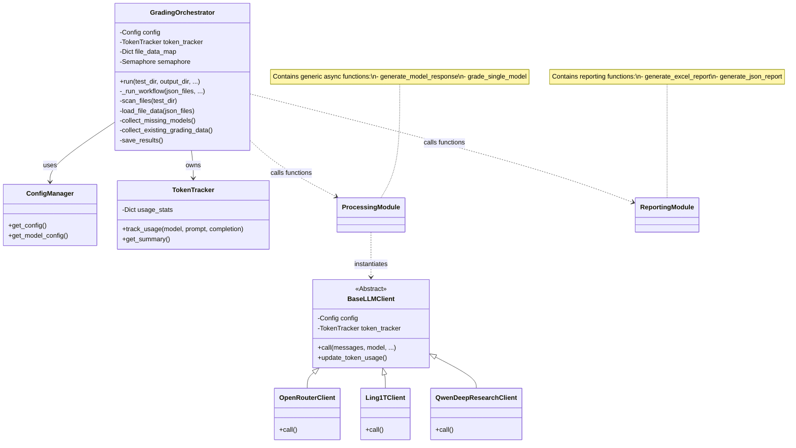
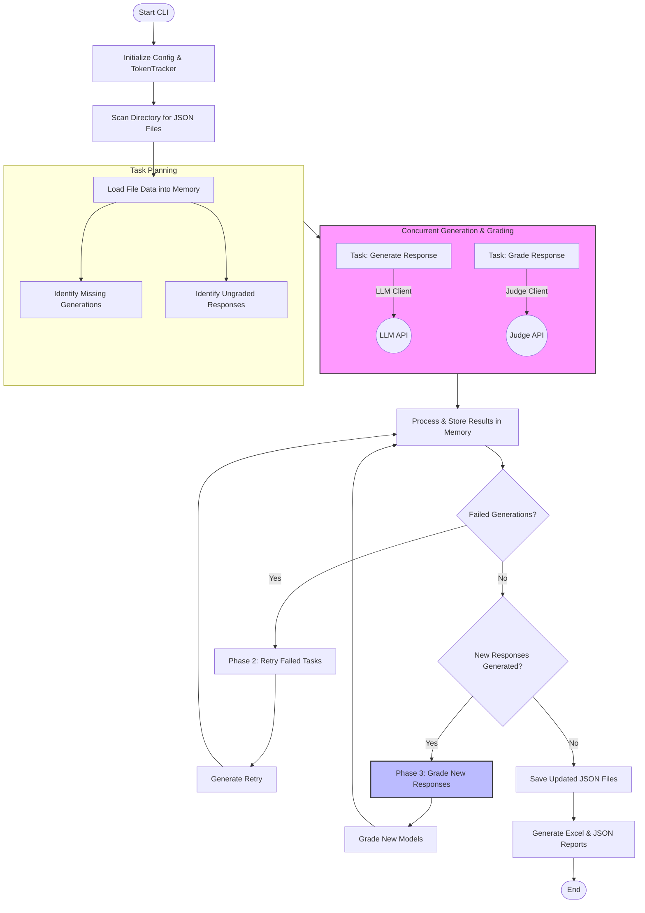

# System Architecture

This document describes the architecture of the **Rubric-based Auto Grading System** (ExpertBench). The system is designed to automate the evaluation of LLM responses against structured rubrics using a Judge LLM.

## Overview

The system operates as a CLI tool that:
1.  Scans a directory of test cases (JSON files containing prompts and rubrics).
2.  Generates responses from candidate models (if missing).
3.  Grades these responses using a "Judge" model against the defined rubrics.
4.  Aggregates results into updated JSON files and summary reports (Excel/JSON).

It relies heavily on asynchronous programming (`asyncio`) for concurrent processing of generation and grading tasks to maximize throughput.

## Class Diagram

The following diagram illustrates the key classes and modules in the system. The `GradingOrchestrator` is the central controller, managing configuration, state, and the execution workflow.

## Process Flow

The system follows a multi-phase workflow to ensure all models have responses and all responses are graded.

## Component Details

### 1. GradingOrchestrator
Located in `src/omb/orchestrator.py`. This class encapsulates the entire application logic. It maintains the state of all test files in `self.file_data_map`, which allows it to update results in-memory before writing them to disk.

### 2. Processing Module
Located in `src/omb/processing/`. Contains the core asynchronous functions:
*   `generate_model_response`: Handles prompting a generator model (e.g., via OpenRouter) to answer the question.
*   `grade_single_model`: Constructs a grading prompt containing the user query, model response, and rubric, then sends it to the Judge model to parse scores.

### 3. Clients
Located in `src/omb/clients/`. Abstracts the differences between various LLM providers. `BaseLLMClient` defines the interface, and subclasses handle specific API signatures (e.g., OpenRouter's OpenAI-compatible API, Ling1T's custom API).

### 4. Reporting
Located in `src/omb/reporting/`. Generates the final artifacts.
*   **Excel Report:** A comprehensive spreadsheet with color-coded scores, consistency checks, and cost breakdowns.
*   **JSON Report:** A machine-readable summary of the run.
